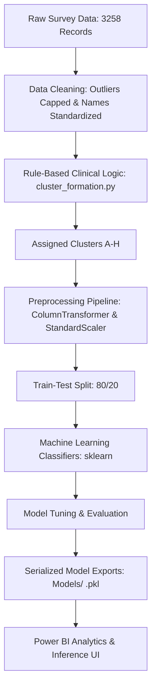
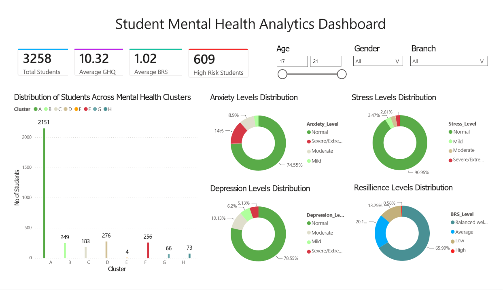
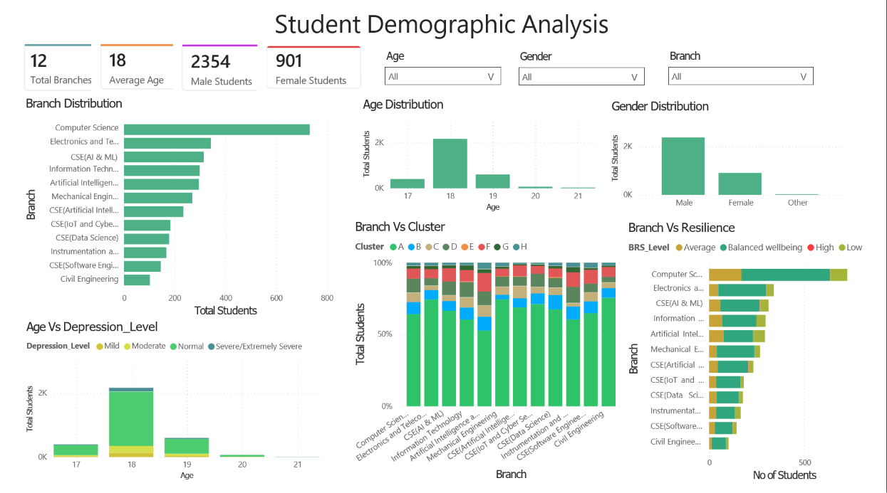
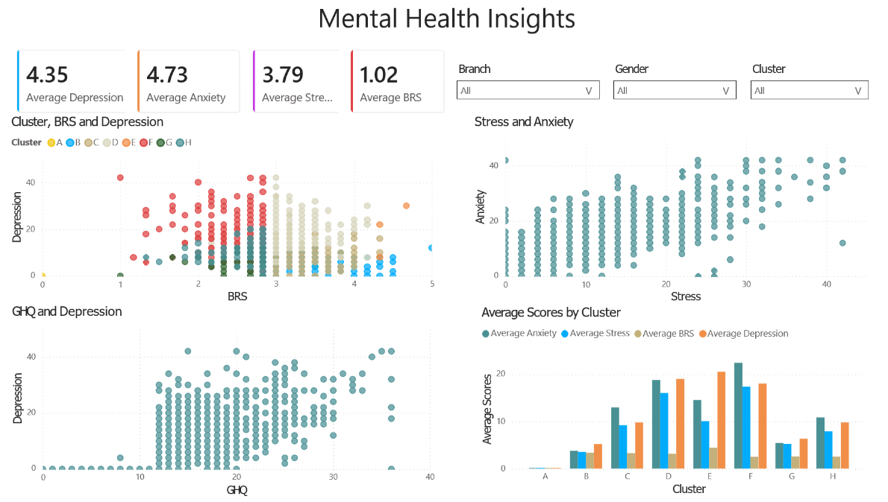
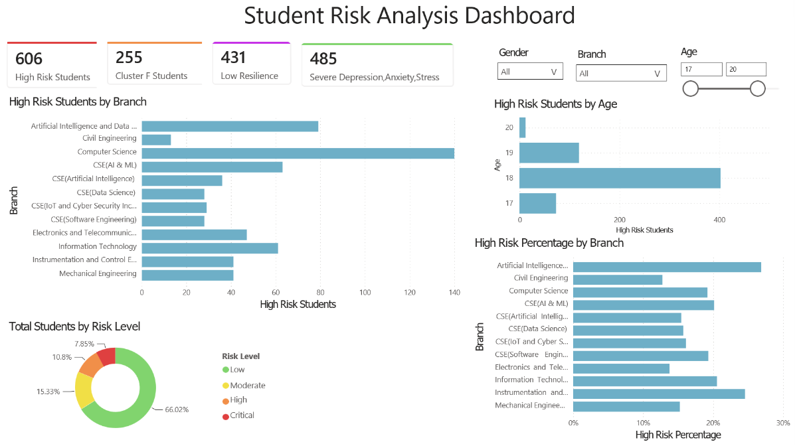

# Student Mental Health Risk Prediction System

An end-to-end Machine Learning and Business Intelligence solution designed to screen, categorize, and predict mental health clusters among college students. The system translates psychological test scores into custom clusters and automates prediction using high-performance classification models.

---

## 📌 Project Overview
This project provides a data-driven framework to assess students' mental wellbeing using established psychological scales:
* **GHQ-12** (General Health Questionnaire) for general psychiatric distress.
* **DASS-21** (Depression, Anxiety, and Stress Scales) for sub-clinical severity assessment.
* **BRS** (Brief Resilience Scale) to evaluate psychological coping capacity.

By combining rule-based clinical scoring with advanced Machine Learning classifiers, this project automates the assignment of students to clinical support groups (clusters), making the screening and triaging process scalable and efficient.

---

## ⚠️ Problem Statement
Educational institutions often struggle to identify and triage students suffering from psychological distress due to manual, time-consuming counseling processes. Delayed detection of severe depression, anxiety, or stress can negatively impact student wellbeing and academic performance. This project aims to:
1. **Automate clinical classification** based on screening test surveys.
2. **Handle demographic and scale variables** to accurately predict target vulnerability groups.
3. **Provide an interactive dashboard** to help university counselors visually track mental health trends.

---

## 📊 Dataset Description
The source dataset (`data/raw/MentalHealthScreeningTest_Report_AllEntries.csv`) contains survey response entries from **3,258 students**.

A cleaned subset of features is selected for preprocessing and model training:
* **Demographics**: `Age` (outliers capped at 18), `Gender` (Male, Female), and `Branch` (Department).
* **Menatal Health Scales**:
  * **GHQ Score**: Scale of general health and psychological wellbeing.
  * **Depression Score**: Derived DASS-I scale score.
  * **Anxiety Score**: Derived DASS-II scale score.
  * **Stress Score**: Derived DASS-III scale score.
  * **BRS Score**: Continuous resilience score.
* **Target variable**: `Cluster` (Clinical classes assigned from `A` to `H` based on severity rules).

---

## 🗺️ Architecture Diagram



---

## 🛠️ Technologies Used
* **Languages**: Python 3.8+
* **Data Processing & Analytics**: Pandas, NumPy
* **Machine Learning**: Scikit-Learn, Joblib
* **Data Visualization**: Seaborn, Matplotlib
* **Jupyter Ecosystem**: Jupyter Notebook
* **Business Intelligence**: Power BI (for dashboard visualization)

---

## ⚙️ ML Workflow
1. **Data Cleaning & Loading**: Capping age outliers, mapping columns, dropping duplicates, and formatting.
2. **Feature Engineering & Rule Classification**: Applying custom psychological threshold rules to group observations into classes (`A` through `H`).
3. **Data Pipeline**: Building a `ColumnTransformer` that normalizes continuous metrics using `StandardScaler` and encodes categorical inputs with `OneHotEncoder`.
4. **Train-Test Partitioning**: Creating a stratified $80/20$ split to maintain cluster representation.
5. **Model Exploration**: Testing multiple estimators (Logistic Regression, KNN, Decision Trees, Random Forests, SVMs, and Gradient Boosting).
6. **Validation & Hyperparameter Tuning**: Evaluating tuning curves for parameters like `max_depth`, `min_samples_split`, `C`, and `n_estimators`.
7. **Serialization**: Exporting final trained models, preprocessors, and encoders for deployment.

---

## 📈 Model Performance
All trained models are compared below based on macro-averaged metrics (recorded in [reports/Evaluation_Metrics_Table.csv]

| Model | Accuracy | Precision (Macro) | Recall (Macro) | F1-Score (Macro) |
| :--- | :---: | :---: | :---: | :---: |
| **Gradient Boosting (XGBoost)** | **99.85%** | **87.17%** | **87.50%** | **87.33%** |
| **Decision Tree** | 99.69% | 86.86% | 87.27% | 87.06% |
| **Random Forest** | 99.54% | 86.56% | 87.05% | 86.78% |
| **SVM** | 96.93% | 81.60% | 80.58% | 81.06% |
| **Logistic Regression** | 94.02% | 73.74% | 67.11% | 68.59% |

*Note: Macro Recall scores reflect performance on minority classes under high class imbalance (e.g. Cluster E containing only 4 samples out of 3,258 records).*

---

## 🖼️ Dashboard Screenshots
An interactive Power BI report is saved under `dashboard/Mental Health Analysis Dashboard.pbix`. You can open this file in Power BI Desktop to view:

Including 4 report pages : 

1. **Mental Health Overview :** 
The Overview Dashboard provides a comprehensive summary of the mental health screening results for all surveyed students. It presents key performance indicators (KPIs), including the total number of students screened, cluster distribution, and overall mental health trends. This dashboard serves as the primary entry point for understanding the overall condition of the student population at a glance.

* Highlights
* - Total students screened and demographic summary.*
* - Distribution of students across clinical clusters (A–H).
* - Quick overview of mental health status and overall screening outcomes.
* - Interactive filters for exploring different student groups.



2. **Demographics Analysis:** 
The Demographic Analysis Dashboard explores how mental health indicators vary across different student demographics, including age, gender, and academic branch. It helps identify vulnerable student groups and supports data-driven decision-making for targeted mental health interventions.

* Highlights
* - Age-wise distribution of students.
* - Gender-based mental health comparison.
* - Department/Branch-wise analysis of psychological wellbeing.
* - Identification of demographic groups with higher mental health risks.



3. **Mental Health Insights:** 
This Dashboard visualizes the distribution and severity of psychological assessment scores, including Depression, Anxiety, Stress (DASS-21), General Health Questionnaire (GHQ-12), and Brief Resilience Scale (BRS). It enables users to understand the prevalence of different mental health conditions and explore relationships between psychological wellbeing and resilience.

* Highlights
* - Distribution of Depression, Anxiety, and Stress severity levels.
* - GHQ-12 and BRS score analysis.
* - Correlation between resilience and psychological distress.
* - Interactive charts for detailed mental health exploration.
 


4. **Student Risk Analysis:** 
This Dashboard provides an in-depth analysis of the custom clinical clusters (A–H) and corresponding risk categories. It enables counselors to identify students requiring immediate support, monitor high-risk populations, and prioritize mental health interventions based on clinical severity.

* Highlights

* - Distribution of students across all clinical clusters.
* - Risk level classification (Low, Moderate, High, Critical).
* - Cluster-wise psychological characteristics and severity patterns.
* - Identification of high-risk student groups for early intervention.



---

## 🚀 Installation

### 1. Clone & Set Up Environment
```bash
# Clone the repository
git clone <repository_url>
cd Mental_Health

# Create a virtual environment
python -m venv venv

# Activate the virtual environment
# Windows:
venv\Scripts\activate
# macOS/Linux:
source venv/bin/activate
```

### 2. Install Required Packages
```bash
pip install pandas numpy scikit-learn joblib matplotlib seaborn notebook
```

---

## 💻 Usage

Run the following Python script to load the serialized pipeline and classify new test observations:

```python
import joblib
import pandas as pd
from src.preprocessing import get_preprocessor

# 1. Load the serialized components
model = joblib.load("Models/Gradient_Boosting_Classifier.pkl")
label_encoder = joblib.load("Models/label_encoder.pkl")

# 2. Mock a new student survey screening response
new_observation = pd.DataFrame({
    'Gender': ['Female'],
    'GHQ': [18],
    'Depression': [14],
    'Anxiety': [18],
    'Stress': [10],
    'BRS': [1.83]
})

# 3. Apply the preprocessing pipeline
preprocessor = get_preprocessor(new_observation)
processed_observation = preprocessor.fit_transform(new_observation)

# 4. Predict target cluster label
predicted_encoded = model.predict(processed_observation)
predicted_label = label_encoder.inverse_transform(predicted_encoded)

print(f"Assigned Mental Health Support Group: {predicted_label[0]}")
```

---

## 🏆 Results
* The **Gradient Boosting Classifier (XGBoost equivalent)** achieved the highest overall recall of **87.50%** and an accuracy of **99.85%**.
* Decision trees and ensemble methods significantly outperformed linear models due to the discrete, non-linear logic boundary of the clinical screening rules.
* General resilience (BRS Score) was proven to have a strong negative correlation with Depression, validating resilience training as an active intervention strategy.

---

## Deployed on Render
Live at: https://student-mental-health-prediction-2.onrender.com

## 🔮 Future Work
* **Class Imbalance Resolution**: Apply synthetic data generation (SMOTE) or focal loss to improve recall on rare classes (like Cluster E).
* **API Deployment**: Wrap the pre-trained `Gradient_Boosting_Classifier.pkl` inside a FastAPI REST endpoint to serve real-time predictions.
* **Frontend Web Application**: Build a React/Vue questionnaire interface allowing students to self-screen and immediately receive triage classification.
